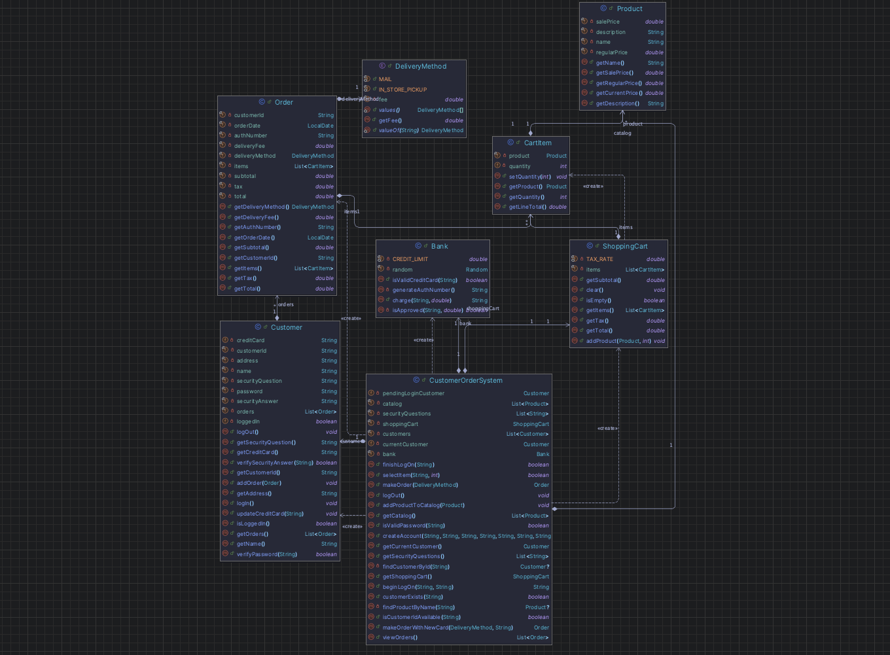

# Project Overview

- This project is a Customer Order System (COS) implemented in Java.
- The project includes a console application and a JavaFX GUI application that let a customer create an account, log on, log out, browse products from a catalog, select items, place an order, and view previous orders.

# Assumptions

- A fixed sales tax rate of 8.25% is used for all orders
- A credit card limit of $5000.00
- A list of three security questions
- Order uses LocalDate to configure the date of the order
- $3.00 fee for mailing orders
- In store pickup is free
- A valid credit card number must be 16 digits
- The bank declines cards that end in 0000
- The product catalog is loaded when the program starts

# UML Diagram

# How to Compile and Run

## Terminal

**Compile:**
mvn compile

**Run Console Application:**
java -cp target/classes jackson.customerordersystem.Main

**Run GUI Application with Maven:**
mvn javafx:run

## Intellij IDEA

- Open the project in IntelliJ IDEA and run the console application:
  jackson.customerordersystem.Main

- To run the GUI application, run the Maven goal:
  javafx:run

- You can also run the JavaFX class directly if IntelliJ has JavaFX configured:
  jackson.customerordersystem.CustomerOrderSystemGUI

# Implemented use cases

- create account
- log on
- log out
- select items
- make order
- view order

# Use case summary

## Create Account:

- The customer enters an id, password, name, address, credit card number, security question, and security answer.
- The system checks for duplicate ids and validates the password and credit card.

## Log On:

- The customer enters an id and password.
- If the password is correct, the system prompts the security question.
- If the answer is correct, the customer is logged in.

## Log Out:

- The customer selects log out and the customer will be logged out.

## Select Items:

- The customer browses the catalog and selects one or more items with the quantities of the product.
- The system adds the products selected to the shopping cart and displays the totals.

## Make Order:

- The customer places an order after logging in and selecting items.
- The system prompts the customer to choose mail or in store pickup.
- The system charges the credit card that is stored.
- If the stored credit card is declined, the customer will be prompted to enter another credit card number or they can exit.
- If the charge is approved, the order is stored and confirmed.

## View Order:

- The customer can view all saved orders after logging in.
- The system shows the order date, products, quantities, totals, delivery fee, and authorization number.

# Part 2 Updates

- Added customerExists(String) method to CustomerOrderSystem to check if a customer ID exists before attempting login.
- Added addProductToCatalog(Product), getCatalog(), and getShoppingCart() accessors to CustomerOrderSystem for use by the console layer.
- Added makeOrderWithNewCard(DeliveryMethod, String) to CustomerOrderSystem to handle when the bank declines the card and the customer provides a new one.
- Removed MAX_LOGIN_ATTEMPTS and failedLoginAttempts from CustomerOrderSystem, login attempt tracking is now in Main.java.
- The UML diagram reflects these changes.

# Part 3 Updates

- Added CustomerOrderSystemGUI.java as a JavaFX GUI application.
- The GUI demonstrates create account, log on, log out, browse catalog, view cart, make order, and view orders.
